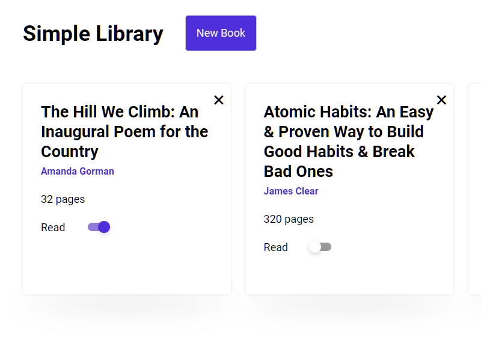

# Simple Library App

This simple app is built with Vanilla JS, HTML and CSS.

Includes:
- DOM manipulation
- Events
- Event delegation
- localStorage for data to store
- template tag usage

[demo](https://ftekmen.github.io/simple_library/)

